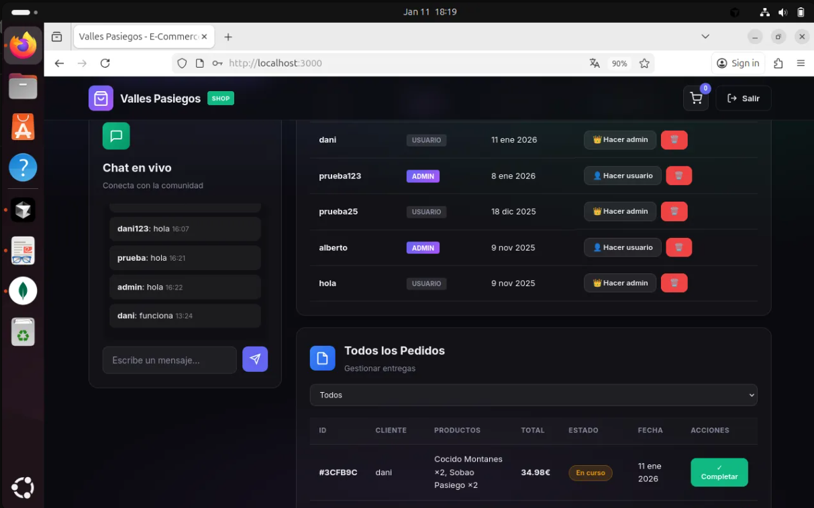
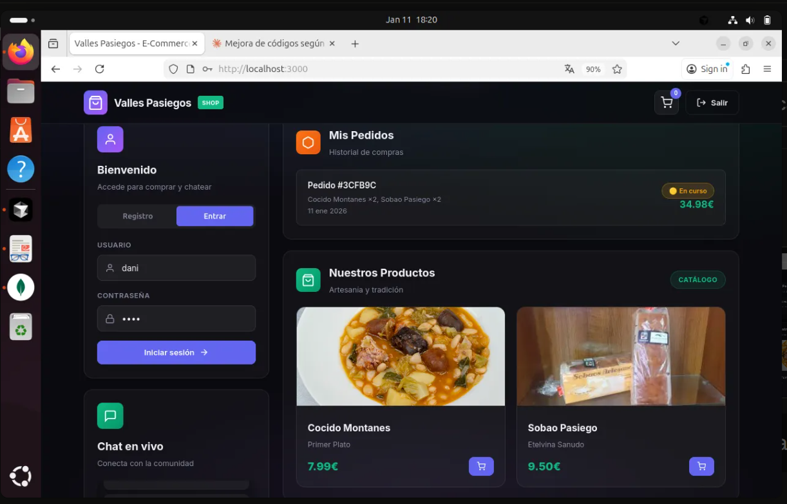

# E-Commerce Valles Pasiegos
---

## Sobre el proyecto

Este proyecto es la evolución de la Práctica 1. He transformado el portal de productos en una tienda online funcional donde los usuarios pueden comprar productos y los administradores gestionan todo desde un panel.

Lo principal que he añadido:
- Sistema de carrito de compra
- Pedidos con estados (en curso / completado)
- GraphQL para las consultas de datos
- Panel de admin para gestionar usuarios y pedidos

---

## Tecnologías

**Backend:** Node.js, Express, MongoDB, Apollo Server (GraphQL), Socket.IO, JWT

**Frontend:** HTML, CSS, JavaScript vanilla

---

## Estructura del proyecto

```
backend/
├── server.js              # Servidor principal
├── config.js              # Configuración
├── models/                # Modelos de MongoDB
│   ├── User.js
│   ├── Product.js
│   ├── Cart.js
│   ├── Order.js
│   └── Message.js
├── routes/                # Rutas REST
│   ├── authRoutes.js
│   ├── productRoutes.js
│   ├── userRoutes.js
│   ├── cartRoutes.js
│   ├── orderRoutes.js
│   └── chatRoutes.js
├── graphql/               # GraphQL
│   ├── schema.js
│   └── resolvers.js
└── middleware/
    └── authenticateJWT.js

frontend/public/
├── index.html
├── styles.css
└── client.js
```

---

## Usuarios 
Los usuarios nuevos son "usuario" por defecto. Para hacer admin:

*Usuario admin ya creado*
usuario: admin ------ contraseña: admin


Usuario normal

```

---

## Modelos de datos

**User:** username, password (hasheado), role (usuario/admin)

**Product:** name, description, price, imagen

**Cart:** userId, items (productos con cantidad), timestamps

**Order:** userId, username, items, total, status (pending/completed), timestamps

**Message:** userId, username, text, timestamp

---

## GraphQL

Endpoint: `/graphql`

### Queries

```graphql
# Productos (público)
products { id name price description imagen }
product(id: ID!) { ... }

# Carrito (logueado)
myCart { items { name price quantity } total }

# Mis pedidos (logueado)
myOrders { id total status createdAt items { name quantity } }

# Admin - todos los pedidos
orders(filter: { status: "pending" }) { id username total status }

# Admin - usuarios
users { id username role createdAt }
```

### Mutations

```graphql
# Carrito
addToCart(productId: ID!, quantity: Int)
updateCartItem(productId: ID!, quantity: Int!)
removeFromCart(productId: ID!)
clearCart

# Pedidos
createOrder    # Convierte el carrito en pedido

# Admin
updateOrderStatus(id: ID!, status: String!)
updateUserRole(id: ID!, role: String!)
deleteUser(id: ID!)
```

---

## API REST

La autenticación se mantiene en REST:

```
POST /api/auth/register   - Registro
POST /api/auth/login      - Login
```

Los productos también tienen endpoints REST (para el CRUD del admin):

```
GET    /api/productos      - Listar
GET    /api/productos/:id  - Detalle
POST   /api/productos      - Crear (admin)
PUT    /api/productos/:id  - Editar (admin)
DELETE /api/productos/:id  - Eliminar (admin)
```

---

## Cómo funciona

### Flujo de compra

1. El usuario se registra/logea
2. Navega por los productos y añade al carrito
3. Abre el carrito, ajusta cantidades
4. Pulsa "Finalizar compra"
5. Se crea un pedido con estado "pending"
6. El admin puede marcarlo como "completed"

### Panel de admin

Cuando un admin inicia sesión ve:
- Gestión de usuarios (cambiar roles, eliminar)
- Todos los pedidos (filtrar por estado, completar)
- Crear productos

---

## Decisiones técnicas

**¿Por qué guardar el carrito en BD?**
Para que persista entre sesiones. Si el usuario cierra el navegador y vuelve, su carrito sigue ahí.

**¿Por qué copiar nombre/precio en el pedido?**
Porque el precio puede cambiar después. El pedido guarda el precio del momento de la compra.

**¿Por qué eliminé chat.js y chat.html**
Decidi integrar todo dentro de index.html y client.js para unificar mas el codigo.

---

## Lo que he implementado

- [x] GraphQL con Apollo Server
- [x] Queries de productos y pedidos
- [x] Mutations de carrito y pedidos
- [x] CRUD de usuarios (admin)
- [x] Carrito persistente en MongoDB
- [x] Estados de pedido (pending/completed)
- [x] Chat en tiempo real (Socket.IO)
- [x] Autenticación JWT con roles

---
